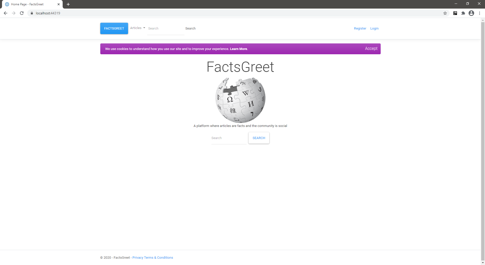
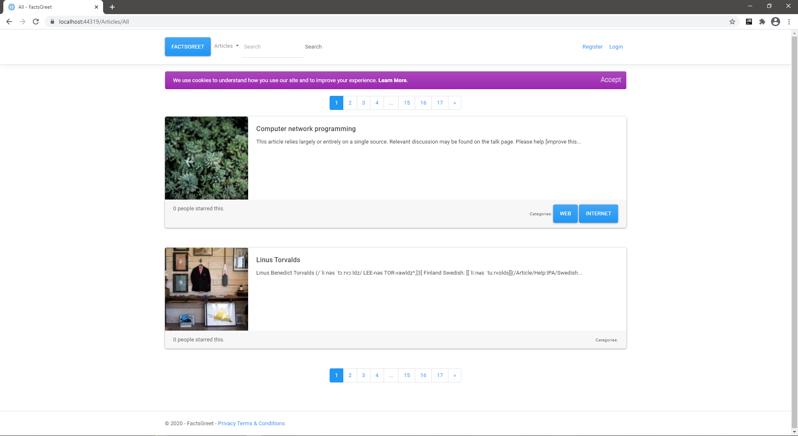
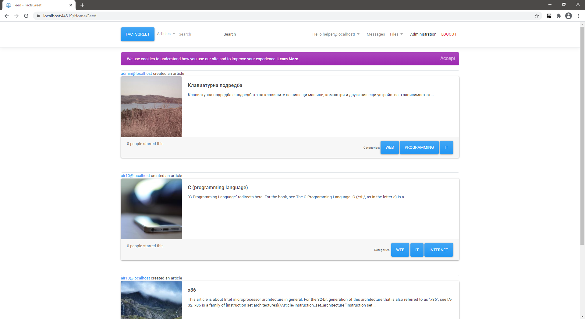
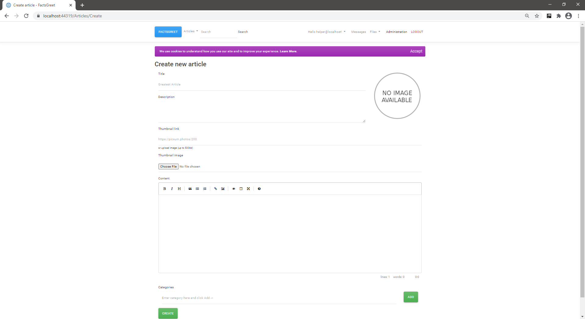
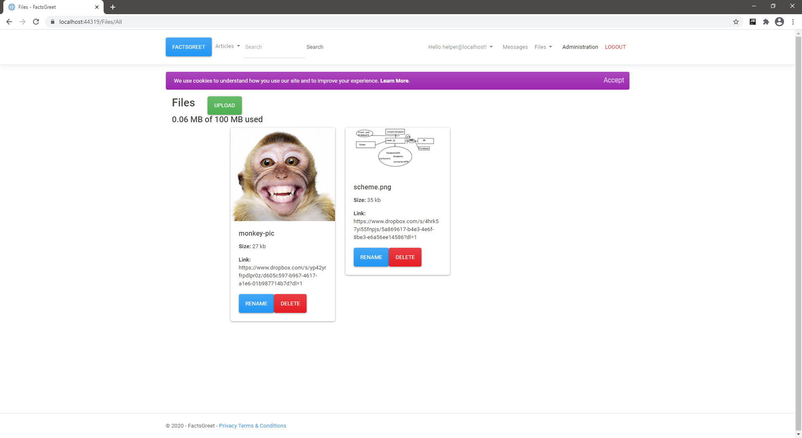
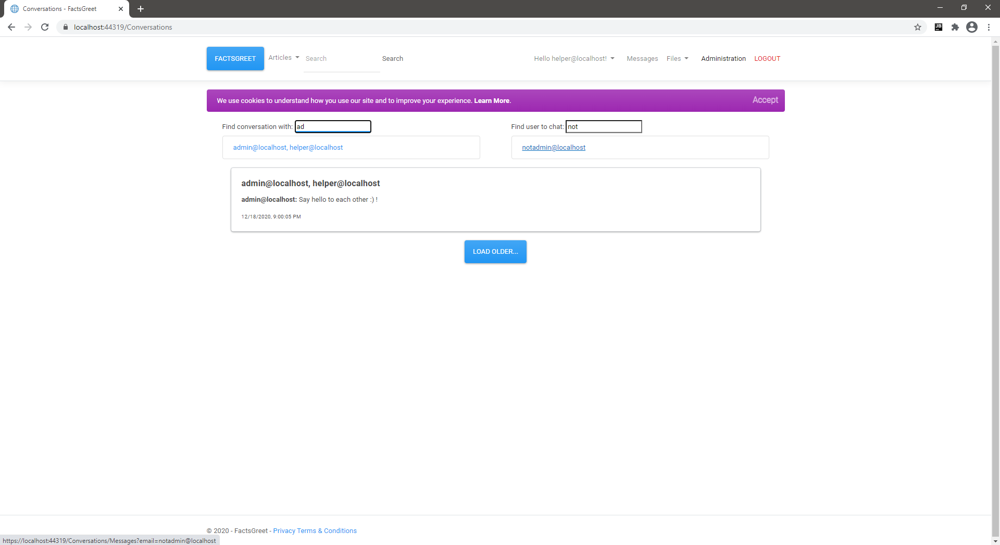
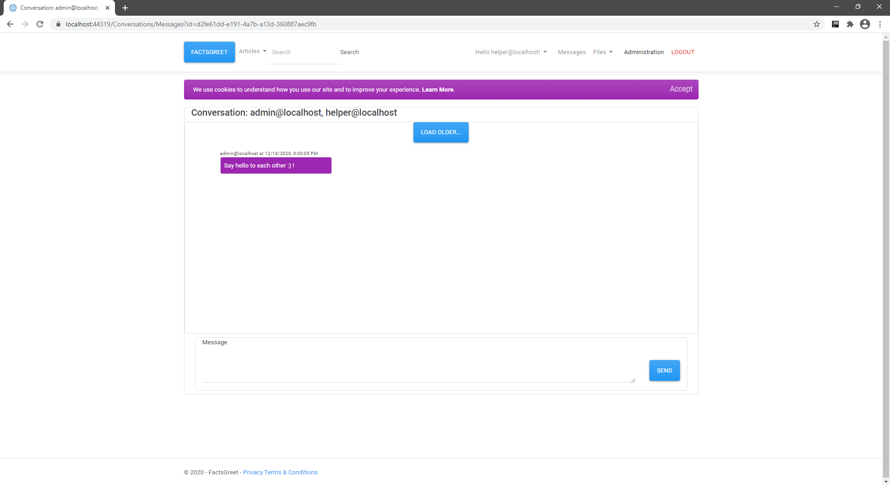
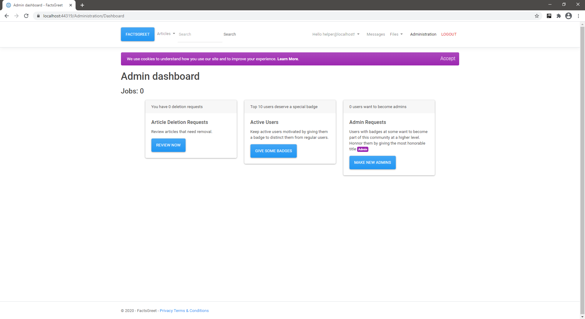
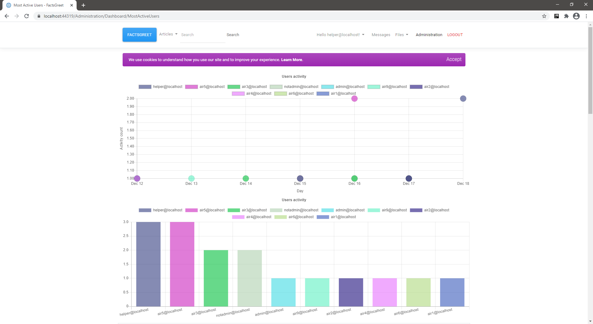
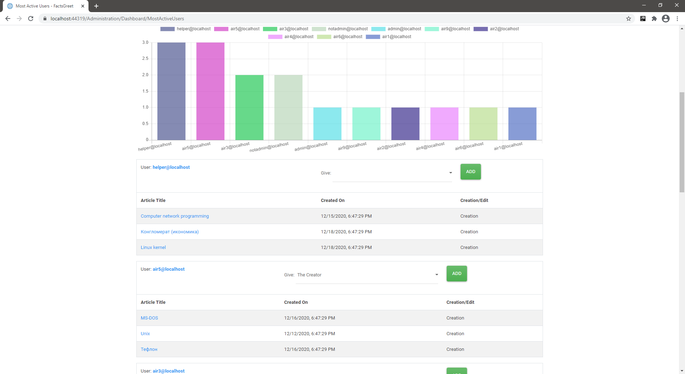

## FactsGreet

FactsGreet is a project that represents my view on how a hybrid between an online encyclopedia and a social network would look like and function.

### Description

---

FactsGreet mainly has two missions: 
- Giving people the correct information for everything they search for
- Making communication between authors, editors and fans easy

As a guest user you can read all articles and view the whole history of an article, including editors' usernames. As a registered user you can create new articles, edit existing ones and follow your favorite authors and editors. If someone follows you back you can initiate a conversation. Being an active user can get you badges to be distinguished from other regular users. If you manage to get half of the badges available out there, you can create an Admin request to join the community at a higher level. On top of everything you have 100 MB public cloud storage for everything you need (photos for your articles, quick notes, etc...). FactsGreet strikes to be the social network for the people searching the facts.

### Technologies used

---

* ASP.NET Core (.NET 5)
* EF Core with PostgreSQL drivers
* Docker
* SignalR
* Dropbox
* AngleSharp
* Bootstrap 4
* JavaScript (ES2015) | used libraries:
	- [Magic Grid](https://github.com/e-oj/Magic-Grid)
	- [SignalR](https://github.com/SignalR/SignalR/wiki/SignalR-JS-Client)
	- [EasyMDE](https://github.com/Ionaru/easy-markdown-editor)
	- [Chart.js](https://github.com/chartjs/Chart.js)
	- [Moment.js](https://github.com/moment/moment)
	- [jsdifflib](https://github.com/cemerick/jsdifflib)
	- [QRCode.js](https://github.com/davidshimjs/qrcodejs)
* xUnit, Moq

### Screenshots

---

#### /Home/Index

#### /Articles/All

#### /Home/Feed

#### /Articles/Create

#### /Files/All

#### /Files/Upload

#### /Conversations/Messages

#### /Home/Index

#### /Home/Index

#### /Administration/Dashboard/Index

#### /Administration/Dashboard/MostActiveUsers (Part 1)

#### /Administration/Dashboard/MostActiveUsers (Part 2)

---

Probably this project will be licensed under MIT License after full dependency check